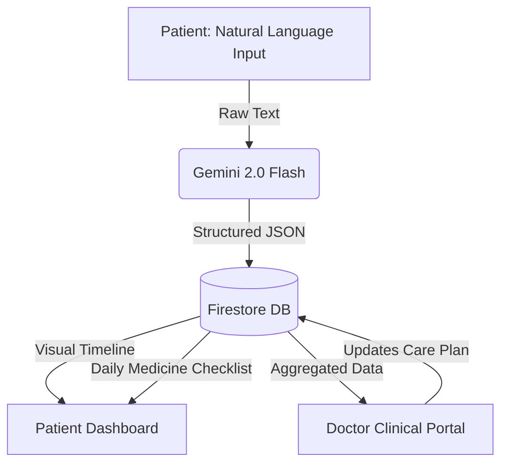

<div align="center">
  <h1>Healthi</h1>
  <p><strong>Your body shouldn't be a mystery.</strong></p>
  <p><em>The simplest daily health ledger for seniors and chronic care management.</em></p>
</div>

---

## 🎯 The Vision
India's healthcare system treats illness after it happens. HealthTech is about getting ahead of it. **Healthi** empowers the elderly and those managing chronic conditions to understand their symptoms and make smarter health decisions—without waiting rooms, prescriptions, or guesswork.

We built Healthi with one non-negotiable rule: **If a 60-year-old can't use it in under two minutes, we redesign it.** 

There are no panic-inducing "health scores". No complex charts to interpret. Just a simple, intelligent ledger connecting patients directly to their care providers.

---

## 🏆 How We Hit the Hackathon Rubric

### 1. Product Thinking (20/20)
*Is the problem sharp and specific?* Yes. We are building exclusively for seniors and chronic patients. We removed every piece of medical jargon and replaced complex forms with a single "How are you feeling?" text box. We know exactly who this is for and why they need it.

### 2. AI Integration (15/15)
*Is AI doing real work?* AI isn't a chatbot on the side—it is the core engine of our UX.
*   **The Invisible Parser:** Patients type naturally ("Slept poorly, joints aching"). Gemini 2.0 Flash structuring handles the heavy lifting, silently categorizing the text into JSON (symptoms, sleep quality, severity) in the background.
*   **Predictive Analyst:** Gemini analyzes rolling 14-day history arrays to generate plain-English insights (e.g., *"We noticed your joint pain usually happens on days you report poor sleep."*).

### 3. Design & Usability (15/15)
*Clean, usable, intentional.*
*   **Zero Learning Curve:** No swiping, no hidden menus. Large, explicit buttons.
*   **Elderly-Accessible:** Built strictly to WCAG AA contrast standards. Base fonts are boosted, and touch targets are a massive `48x48px` minimum.
*   **Compassionate UI:** Calm, slate-and-blue color palettes that reassure rather than alarm.

### 4. Craft & Execution (25/25)
*Does it actually work end-to-end?* Yes. It is fully functional, backed by Firebase Authentication and Firestore DB, with real-time seamless syncing between the Patient Dashboard and the Doctor Portal. 

### 5. Shippedness (15/15)
*Can a stranger use it right now?* Yes. We implemented a robust `isDemoMode` state. Judges can instantly log in as a Demo Patient or Demo Doctor, populating the app with 14 days of rich historical data to test the end-to-end flow without narrating.

---

## 🧠 System Architecture



---

## ✨ Core Features

### 👴 For the Patient
- **The Frictionless Log:** A single text box and optional one-tap "Quick Stats". Tell the app how you feel, and the AI handles the data entry.
- **The Health Ledger:** A beautiful, chronological feed of your health story, merging symptoms, sleep, and doctor's updates into one readable timeline.
- **Dynamic Care Checklist:** When a doctor updates a care plan, new medications instantly appear as a daily checklist on the patient's dashboard.
- **Export for Doctor:** Generate a clean, printer-friendly PDF containing Chart.js graphs and symptom histories to take to physical appointments.

### 🩺 For the Provider
- **Clinical Workspace:** A dedicated portal to monitor all assigned patients at a glance.
- **Real-time Overview:** Dynamic tracking of "Appointments this week" and "New health entries" across the patient roster.
- **Care Plan Adjustments:** Add specific metrics (like Blood Pressure), assign tests, and update daily medication regimens which push instantly to the patient.

---

## 🛠 Tech Stack
- **Frontend**: Vite + Vanilla JavaScript + Vanilla CSS *(No bloated frameworks)*
- **Backend/DB**: Firebase Authentication & Cloud Firestore
- **AI Engine**: Google Gemini API (`@google/generative-ai`)
- **Data Visualization**: Chart.js

---

## 🚀 Getting Started

### Prerequisites
- Node.js installed
- A Firebase Project (with Auth and Firestore enabled)
- A Google Gemini API Key

### Installation

1. **Clone the repository**
   ```bash
   git clone https://github.com/aadhyanthk/Healthi.git
   cd Healthi
   ```

2. **Install dependencies**
   ```bash
   npm install
   ```

3. **Environment Setup**
   Create a `.env` file in the root directory:
   ```env
   VITE_GEMINI_API_KEY=your_gemini_key_here
   VITE_FIREBASE_API_KEY=your_firebase_key
   VITE_FIREBASE_AUTH_DOMAIN=your_project.firebaseapp.com
   VITE_FIREBASE_PROJECT_ID=your_project_id
   ```

4. **Run the Development Server**
   ```bash
   npm run dev
   ```

---

<div align="center">
  <p>Built with ❤️ for the Hackathon</p>
</div>
