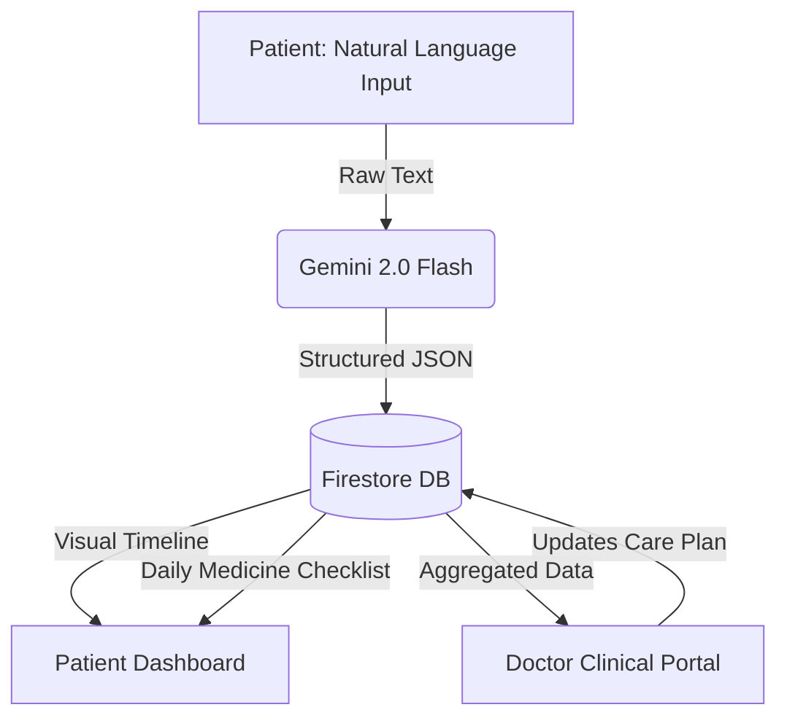

<div align="center">
  <h1>Healthi</h1>
  <p><strong>Your body shouldn't be a mystery.</strong></p>
  <p><em>The simplest daily health ledger for seniors and chronic care management.</em></p>
  <p><strong>Built for MicroCraft - ArcNight</strong></p>
</div>

---

## 🎯 The Vision
India's healthcare system treats illness after it happens. HealthTech should be about getting ahead of it. **Healthi** empowers the elderly and those managing chronic conditions to understand their symptoms, recognize patterns, and make smarter health decisions—without waiting rooms, prescriptions, or guesswork.

We built Healthi with one non-negotiable rule: **If a 60-year-old can't use it in under two minutes, we redesign it.** 

There are no panic-inducing "health scores." No complex charts to interpret. Just a simple, intelligent ledger connecting patients directly to their care providers.

---

## ✨ Thoughtful, Invisible UX

We obsessed over the tiny details so that our users don't have to.

### 🧠 Deep, Seamless AI Integration
AI shouldn't be a decorative chatbot on the side of the screen. In Healthi, AI does the real work silently:
- **The Invisible Parser:** We eliminated complex medical intake forms. Patients simply type how they feel naturally (*"Slept poorly, joints aching"*). Gemini 2.0 Flash silently parses the raw text in the background, extracting symptoms, sleep quality, and severity into structured JSON.
- **The Predictive Analyst:** Instead of making users manually hunt for correlations, Gemini analyzes their rolling 14-day history and delivers proactive, plain-English insights (e.g., *"We noticed your joint pain usually happens on days you report poor sleep."*).

### 🎨 Compassionate, Senior-First Design
Great design should be invisible to the user.
- **Anxiety-Free Tracking:** We intentionally removed generic "health scores" (e.g., 65/100) that often induce anxiety. Instead, we use a beautifully simple, chronological timeline.
- **Fat-Finger Friendly:** Every single interactive element and button is designed with a strict `48x48px` minimum touch target for those with limited dexterity.
- **High Readability:** Adhering to WCAG AA standards, we use a calming, high-contrast slate-and-blue color palette and boosted base font sizes that are perfectly legible for aging eyes.

### 🏥 True End-to-End Clinical Value
A polished mockup isn't enough; Healthi is a live, functional ecosystem connecting the home to the clinic.
- **Dynamic Care Checklists:** When a doctor updates a patient's care plan from their portal, new medications instantly appear as an interactive daily checklist on the patient's home dashboard.
- **Printer-Friendly Doctor Export:** With one click, the app generates a clean, printable PDF containing Chart.js visual timelines and symptom histories, designed specifically to be handed to a doctor during a physical visit.
- **Zero-Friction Logging:** Optional "Quick Stats" buttons allow patients to log their mood, appetite, and hydration with a single tap, appending gracefully to their daily text entry.

---

## ⚙️ System Architecture



---

## 🚀 Instant Demo & Shipped State

We know how painful it is to evaluate an empty app. Healthi ships with a robust **Demo Mode**. 
Anyone can instantly log in as a "Demo Patient" or "Demo Doctor", bypassing tedious manual data entry to immediately experience the app pre-populated with 14 days of rich historical health logs, clinical metrics, and doctor interactions.

---

## 🛠 Tech Stack
- **Frontend**: Vite + Vanilla JavaScript + Vanilla CSS *(No bloated frameworks)*
- **Backend & Database**: Firebase Authentication & Cloud Firestore
- **AI Engine**: Google Gemini API (`@google/generative-ai`)
- **Data Visualization**: Chart.js

---

## 💻 Local Setup

### Prerequisites
- Node.js installed
- A Firebase Project (with Auth and Firestore enabled)
- A Google Gemini API Key

### Installation

1. **Clone the repository**
   ```bash
   git clone https://github.com/aadhyanthk/Healthi.git
   cd Healthi
   ```

2. **Install dependencies**
   ```bash
   npm install
   ```

3. **Environment Setup**
   Create a `.env` file in the root directory:
   ```env
   VITE_GEMINI_API_KEY=your_gemini_key_here
   VITE_FIREBASE_API_KEY=your_firebase_key
   VITE_FIREBASE_AUTH_DOMAIN=your_project.firebaseapp.com
   VITE_FIREBASE_PROJECT_ID=your_project_id
   ```

4. **Run the Development Server**
   ```bash
   npm run dev
   ```

---
<div align="center">
  <p>Built for the <strong>MicroCraft - ArcNight</strong> Hackathon</p>
</div>
